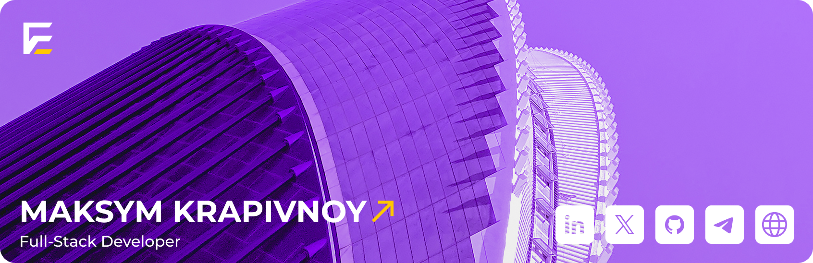

[**[Hire A Talent](https://tally.so/r/3lldZB)**]
[**[Request A Quote](https://tally.so/r/3lldZB)**]
[**[Find Jobs](https://tally.so/r/3j9Qza)**] \_\_\_
[**[For Companies](https://tally.so/r/3lldZB)**]
[**[For Developers](https://tally.so/r/3j9Qza)**]

[**[Chat With Me](https://www.linkedin.com/in/maksym-krapivnoy-a50870164/)**]
[**[Work With Me](https://www.linkedin.com/in/maksym-krapivnoy-a50870164/)**]

# 💫 About Me:
 👋 Hi, I’m Maksym, a full-stack developer focused on building innovative tech solutions!  🔭 Working on a next-gen freelance platform for top tech talent.  👯 Looking to collaborate on projects with real-world impact. 💬 Ask me about Full-stack dev, microservices, and JavaScript frameworks.

## 🌐 Socials:
 

# 💻 Tech Stack:
                    
# 📊 GitHub Stats:
 
 

---

<!-- Proudly created with GPRM ( https://gprm.itsvg.in ) -->
